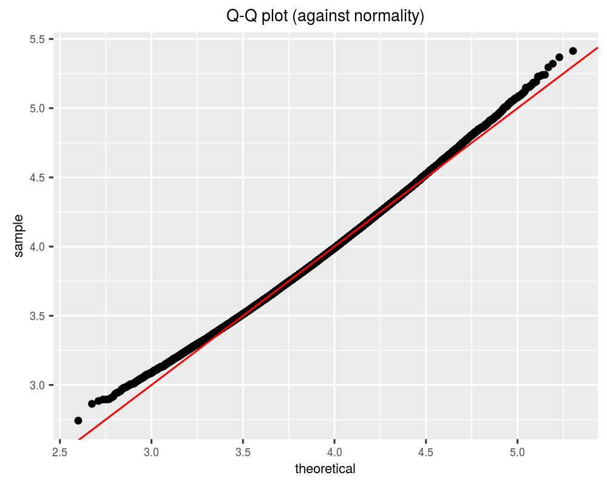
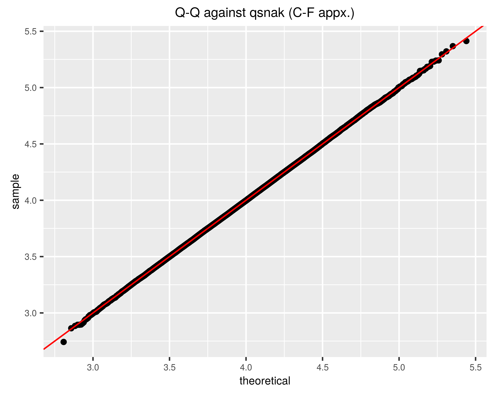
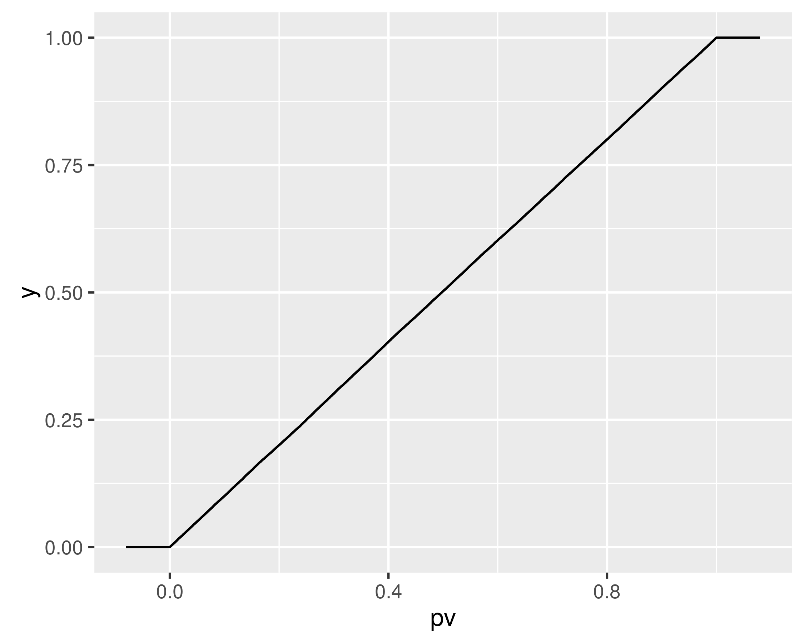
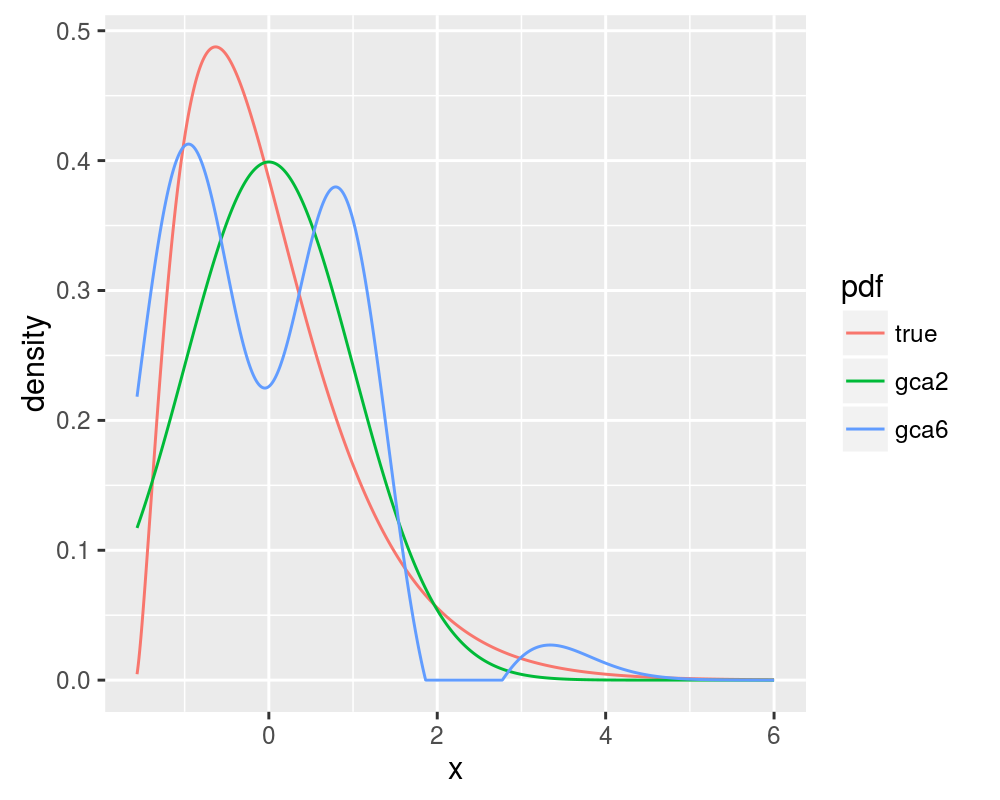
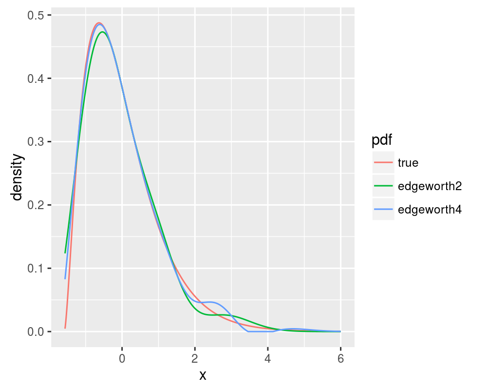
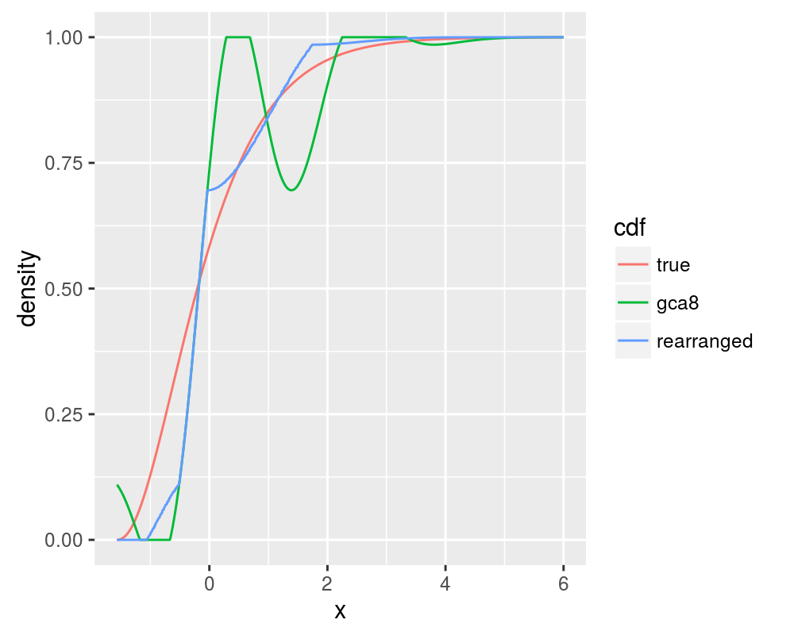

# PDQutils

[](https://travis-ci.org/shabbychef/PDQutils)
[](http://codecov.io/github/shabbychef/PDQutils?branch=master)
[](https://cran.r-project.org/package=PDQutils)
[](http://www.r-pkg.org/pkg/PDQutils)
[](http://www.r-pkg.org/pkg/PDQutils)

PDQ Functions via Gram Charlier, Edgeworth, and Cornish Fisher Approximations

-- Steven E. Pav, shabbychef@gmail.com

## Installation

This package may be installed from CRAN; the latest development version may be
installed via [drat](https://github.com/eddelbuettel/drat "drat"), or built from
[github](https://www.github.com/shabbychef/PDQutils "PDQutils"):


```r
# install via CRAN:
install.packages("PDQutils")

# get latest dev release via drat:
if (require(drat)) {
    drat:::add("shabbychef")
    install.packages("PDQutils")
}

# get snapshot from github (may be buggy)
if (require(devtools)) {
    install_github("shabbychef/PDQutils")
}
```

# Basic Usage

Approximating the distribution of a random variable via the Gram Charlier, Edgeworth, or Cornish Fisher
expansions is most convenient when the random variable can be decomposed as the sum of a 
small number of independent random variables whose cumulants can be computed. For example, 
suppose $Y = \sum_{1 \le i \le k} \sqrt{X_i / \nu_i}$ where the $X_i$ are independent central 
chi-square random variables with degrees of freedom $\nu_1,\nu_2,...,\nu_k$. I will call this
a 'snak' distribution, for 'sum of Nakagami', since each summand follows a 
[Nakagami distribution](https://en.wikipedia.org/wiki/Nakagami_distribution "Nakagami distribution").
We can easily write code that generates variates from this distribution given a vector
of the degrees of freedom:


```r
rsnak <- function(n, dfs) {
    samples <- Reduce("+", lapply(dfs, function(k) {
        sqrt(rchisq(n, df = k)/k)
    }))
}
```

Let's take one hundred thousand draws from this distribution and see whether it is approximately normal,
by performing a q-q plot against a normal distribution.


```r
n.samp <- 1e+05
dfs <- c(8, 15, 4000, 10000)
set.seed(18181)
# now draw from the distribution
rvs <- rsnak(n.samp, dfs)

data <- data.frame(draws = rvs)
mu <- mean(rvs)
sigma <- sd(rvs)
library(ggplot2)
ph <- ggplot(data, aes(sample = draws)) + stat_qq(distribution = function(p) {
    qnorm(p, mean = mu, sd = sigma)
}) + geom_abline(slope = 1, intercept = 0, colour = "red") + 
    theme(text = element_text(size = 8)) + labs(title = "Q-Q plot (against normality)")
print(ph)
```



While this is very nearly normal, we can get a better approximation.
Using the additivity
property of cumulants, we can compute the cumulants of $Y$ easily if we have the cumulants of
the $X_i$. These in turn can be computed from the raw moments.  See
[wikipedia](https://en.wikipedia.org/wiki/Chi_distribution "chi distribution") for the raw moments
of the Chi distribution. The following function computes the cumulants:


```r
# for the moment2cumulant function:
library(PDQutils)
# compute the first ord.max raw cumulants of the
# sum of Nakagami variates
snak_cumulants <- function(dfs, ord.max = 10) {
    # first compute the raw moments
    moms <- lapply(dfs, function(k) {
        ords <- 1:ord.max
        moms <- 2^(ords/2) * exp(lgamma((k + ords)/2) - 
            lgamma(k/2))
        # we are dividing the chi by sqrt the d.f.
        moms <- moms/(k^(ords/2))
        moms
    })
    # turn moments into cumulants
    cumuls <- lapply(moms, moment2cumulant)
    # sum the cumulants
    tot.cumul <- Reduce("+", cumuls)
    return(tot.cumul)
}
```

We can now implement the 'dpq' functions trivially using the Edgeworth and Cornish Fisher
approximations, as follows:


```r
library(PDQutils)

dsnak <- function(x, dfs, ord.max = 6, ...) {
    raw.cumul <- snak_cumulants(dfs, ord.max)
    retval <- dapx_edgeworth(x, raw.cumul, support = c(0, 
        Inf), ...)
    return(retval)
}
psnak <- function(q, dfs, ord.max = 6, ...) {
    raw.cumul <- snak_cumulants(dfs, ord.max)
    retval <- papx_edgeworth(q, raw.cumul, support = c(0, 
        Inf), ...)
    return(retval)
}
qsnak <- function(p, dfs, ord.max = 10, ...) {
    raw.cumul <- snak_cumulants(dfs, ord.max)
    retval <- qapx_cf(p, raw.cumul, support = c(0, 
        Inf), ...)
    return(retval)
}
```

The density and distribution functions could also have been implemented via the 
Gram Charlier expansion, although there seems to be little justification for so doing,
as the Edgeworth expansion is 
[often a better approximation](http://arxiv.org/abs/astro-ph/9711239 "Blinnikov and Moessner").


```r
dsnak_2 <- function(x, dfs, ord.max = 10, ...) {
    raw.moment <- cumulant2moment(snak_cumulants(dfs, 
        ord.max))
    retval <- dapx_gca(x, raw.moment, support = c(0, 
        Inf), ...)
    return(retval)
}
psnak_2 <- function(q, dfs, ord.max = 10, ...) {
    raw.moment <- cumulant2moment(snak_cumulants(dfs, 
        ord.max))
    retval <- papx_gca(q, raw.moment, support = c(0, 
        Inf), ...)
    return(retval)
}
```

The q-q plot looks better now:


```r
data <- data.frame(draws = rvs)
library(ggplot2)
ph <- ggplot(data, aes(sample = draws)) + stat_qq(distribution = function(p) {
    qsnak(p, dfs = dfs)
}) + geom_abline(slope = 1, intercept = 0, colour = "red") + 
    theme(text = element_text(size = 8)) + labs(title = "Q-Q against qsnak (C-F appx.)")
print(ph)
```



Note that the q-q plot uses the approximate quantile function, qsnak. If we compute the
approximate CDF of the random draws, we hope it will be nearly uniform, and indeed
it is:


```r
apx.p <- psnak(rvs, dfs = dfs)
if (require(ggplot2)) {
    # qplot(apx.p, stat='ecdf', geom='step')
    ggplot(data.frame(pv = apx.p), aes(x = pv)) + stat_ecdf(geom = "step")
}
```



# Edgeworth versus Gram Charlier

[Blinnikov and Moessner](http://arxiv.org/abs/astro-ph/9711239 "Blinnikov and Moessner") note that
the Gram Charlier expansion will actually _diverge_ for some distributions when more terms in
the expansion are considered, behaviour which is not seen for the Edgeworth expansion. We will consider
the case of a chi-square distribution with 5 degrees of freedom. The 2 and 6 term Gram Charlier expansions
are shown, along with the true value of the PDF, replicating figure 1 of Blinnikov and Moessner:


```r
# compute moments and cumulants:
df <- 5
max.ord <- 20
subords <- 0:(max.ord - 1)
raw.cumulants <- df * (2^subords) * factorial(subords)
raw.moments <- cumulant2moment(raw.cumulants)

# compute the PDF of the rescaled variable:
xvals <- seq(-sqrt(df/2) * 0.99, 6, length.out = 1001)
chivals <- sqrt(2 * df) * xvals + df
pdf.true <- sqrt(2 * df) * dchisq(chivals, df = df)

pdf.gca2 <- sqrt(2 * df) * dapx_gca(chivals, raw.moments = raw.moments[1:2], 
    support = c(0, Inf))
pdf.gca6 <- sqrt(2 * df) * dapx_gca(chivals, raw.moments = raw.moments[1:6], 
    support = c(0, Inf))

all.pdf <- data.frame(x = xvals, true = pdf.true, gca2 = pdf.gca2, 
    gca6 = pdf.gca6)

# plot it by reshaping and ggplot'ing
require(reshape2)
arr.data <- melt(all.pdf, id.vars = "x", variable.name = "pdf", 
    value.name = "density")

require(ggplot2)
ph <- ggplot(arr.data, aes(x = x, y = density, group = pdf, 
    colour = pdf)) + geom_line()
print(ph)
```



Compare this with the 2 and 4 term Edgeworth expansions, replicating figure 6 of Blinnikov and Moessner:

```r
# compute the PDF of the rescaled variable:
xvals <- seq(-sqrt(df/2) * 0.99, 6, length.out = 1001)
chivals <- sqrt(2 * df) * xvals + df
pdf.true <- sqrt(2 * df) * dchisq(chivals, df = df)

pdf.edgeworth2 <- sqrt(2 * df) * dapx_edgeworth(chivals, 
    raw.cumulants = raw.cumulants[1:4], support = c(0, 
        Inf))
pdf.edgeworth4 <- sqrt(2 * df) * dapx_edgeworth(chivals, 
    raw.cumulants = raw.cumulants[1:6], support = c(0, 
        Inf))

all.pdf <- data.frame(x = xvals, true = pdf.true, edgeworth2 = pdf.edgeworth2, 
    edgeworth4 = pdf.edgeworth4)

# plot it by reshaping and ggplot'ing
require(reshape2)
arr.data <- melt(all.pdf, id.vars = "x", variable.name = "pdf", 
    value.name = "density")

require(ggplot2)
ph <- ggplot(arr.data, aes(x = x, y = density, group = pdf, 
    colour = pdf)) + geom_line()
print(ph)
```



# Rearranging for monotonicity 

In one of a series of papers, [Chernozhukov et. al.](http://arxiv.org/abs/0708.1627 "Chernozhukov et. al.") 
demonstrate the use of monotonic rearrangements in Edgeworth and Cornish-Fisher expansions of the CDF
and quantile functions, which are, by definition, non-decreasing. It is shown that monotone rearrangement
reduces the error of an initial approximation. This is easy enough to code with tools readily available
in R.  First, let us compute the 8 term Gram Charlier approximation to the CDF of the Chi-square with
5 degrees of freedom. This should display non-monotonicity. Then we compute the monotonic rearrangement:


```r
df <- 5
max.ord <- 20
subords <- 0:(max.ord - 1)
raw.cumulants <- df * (2^subords) * factorial(subords)
raw.moments <- cumulant2moment(raw.cumulants)

# compute the CDF of the rescaled variable:
xvals <- seq(-sqrt(df/2) * 0.99, 6, length.out = 1001)
chivals <- sqrt(2 * df) * xvals + df
cdf.true <- pchisq(chivals, df = df)
cdf.gca8 <- papx_gca(chivals, raw.moments = raw.moments[1:8], 
    support = c(0, Inf))

# it is this simple:
require(quantreg)
in.fn <- stepfun(xvals, c(0, cdf.gca8))
out.fn <- rearrange(in.fn)
cdf.rearranged <- out.fn(xvals)

all.cdf <- data.frame(x = xvals, true = cdf.true, gca8 = cdf.gca8, 
    rearranged = cdf.rearranged)

# plot it by reshaping and ggplot'ing
require(reshape2)
arr.data <- melt(all.cdf, id.vars = "x", variable.name = "cdf", 
    value.name = "density")

require(ggplot2)
ph <- ggplot(arr.data, aes(x = x, y = density, group = cdf, 
    colour = cdf)) + geom_line()
print(ph)
```



