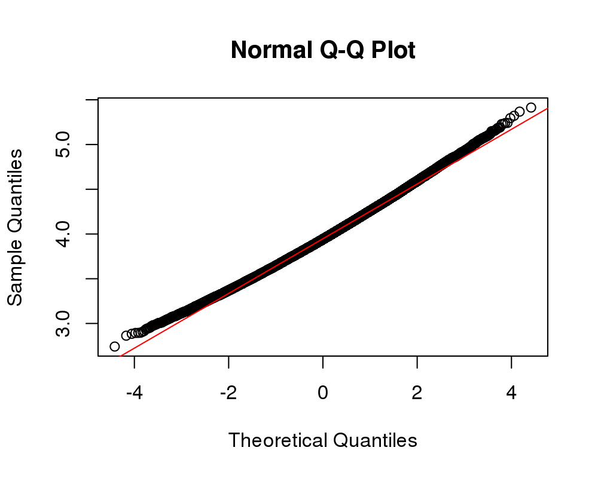
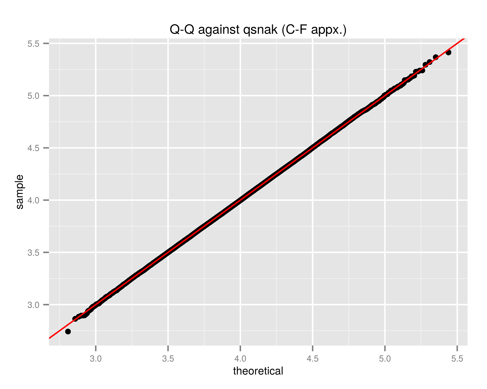
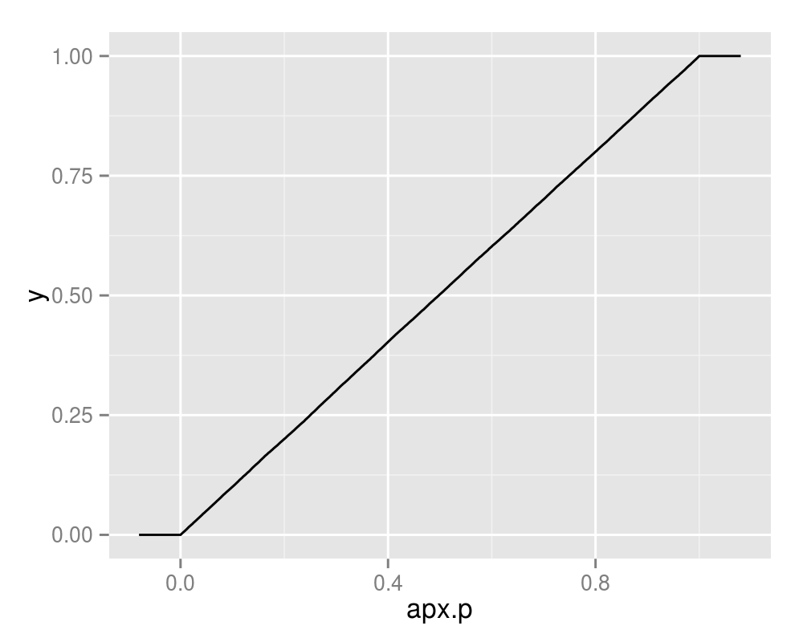
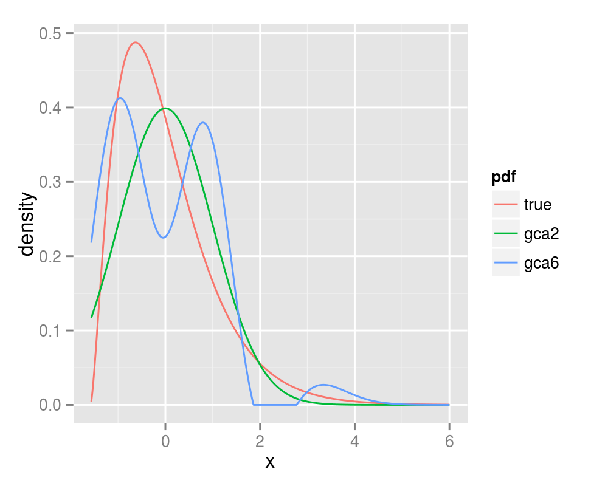

# PDQutils

PDQ Functions via Gram Charlier, Edgeworth, and Cornish Fisher Approximations

-- Steven E. Pav, shabbychef@gmail.com

## Installation

This package may be installed from CRAN; the latest version may be
found on [github](https://www.github.com/shabbychef/PDQutils "PDQutils")
via devtools:


```r
if (require(devtools)) {
    # latest greatest
    install_github("shabbychef/PDQutils")
}
```

# Basic Usage

Approximating the distribution of a random variable via the Gram Charlier, Edgeworth, or Cornish Fisher
expansions is most convenient when the random variable can be decomposed as the sum of a 
small number of independent random variables whose cumulants can be computed. For example, 
suppose $Y = \sum_{1 \le i \le k} \sqrt{X_i / \nu_i}$ where the $X_i$ are independent central 
chi-square random variables with degrees of freedom $\nu_1,\nu_2,...,\nu_k$. I will call this
a 'snak' distribution, for 'sum of Nakagami', since each summand follows a 
[Nakagami distribution](https://en.wikipedia.org/wiki/Nakagami_distribution "Nakagami distribution").
We can easily write code that generates variates from this distribution given a vector
of the degrees of freedom:


```r
rsnak <- function(n, dfs) {
    samples <- Reduce("+", lapply(dfs, function(k) {
        sqrt(rchisq(n, df = k)/k)
    }))
}
```

Let's take one hundred thousand draws from this distribution and see whether it is approximately normal,
by performing a q-q plot against a normal distribution.


```r
n.samp <- 1e+05
dfs <- c(8, 15, 4000, 10000)
set.seed(18181)
# now draw from the distribution
rvs <- rsnak(n.samp, dfs)
qqnorm(rvs)
qqline(rvs, col = "red")
```



While this is very nearly normal, we can get a better approximation.
Using the additivity
property of cumulants, we can compute the cumulants of $Y$ easily if we have the cumulants of
the $X_i$. These in turn can be computed from the raw moments.  See
[wikipedia](https://en.wikipedia.org/wiki/Chi_distribution "chi distribution") for the raw moments
of the Chi distribution. The following function computes the cumulants:


```r
# for the moment2cumulant function:
library(PDQutils)
# compute the first ord.max raw cumulants of the
# sum of Nakagami variates
snak_cumulants <- function(dfs, ord.max = 10) {
    # first compute the raw moments
    moms <- lapply(dfs, function(k) {
        ords <- 1:ord.max
        moms <- 2^(ords/2) * exp(lgamma((k + ords)/2) - 
            lgamma(k/2))
        # we are dividing the chi by sqrt the d.f.
        moms <- moms/(k^(ords/2))
        moms
    })
    # turn moments into cumulants
    cumuls <- lapply(moms, moment2cumulant)
    # sum the cumulants
    tot.cumul <- Reduce("+", cumuls)
    return(tot.cumul)
}
```

We can now implement the 'dpq' functions trivially using the Gram-Charlier and Cornish-Fisher
approximations, as follows:


```r
library(PDQutils)

dsnak <- function(x, dfs, ord.max = 10, ...) {
    raw.moment <- cumulant2moment(snak_cumulants(dfs, 
        ord.max))
    retval <- dapx_gca(x, raw.moment, support = c(0, 
        Inf), ...)
    
    return(retval)
}
psnak <- function(q, dfs, ord.max = 10, ...) {
    raw.moment <- cumulant2moment(snak_cumulants(dfs, 
        ord.max))
    retval <- papx_gca(q, raw.moment, support = c(0, 
        Inf), ...)
    return(retval)
}
qsnak <- function(p, dfs, ord.max = 10, ...) {
    raw.cumul <- snak_cumulants(dfs, ord.max)
    retval <- qapx_cf(p, raw.cumul, support = c(0, 
        Inf), ...)
    return(retval)
}
```

The q-q plot looks better now:


```r
qqplot(qsnak(ppoints(n.samp), dfs = dfs), rvs, main = "Q-Q against qsnak (C-F appx.)")
qqline(rvs, distribution = function(p) qsnak(p, dfs), 
    col = "red")
```



Note that the q-q plot uses the approximate quantile function, qsnak. If we compute the
approximate CDF of the random draws, we hope it will be nearly uniform, and indeed
it is:


```r
apx.p <- psnak(rvs, dfs = dfs)
if (require(ggplot2)) {
    qplot(apx.p, stat = "ecdf", geom = "step")
}
```



# Edgeworth versus Gram Charlier

[Blinnikov and Moessner](http://arxiv.org/abs/astro-ph/9711239 "Blinnikov and Moessner") note that
the Gram Charlier expansion will actually _diverge_ for some distributions when more terms in
the expansion are considered, behaviour which is not seen for the Edgeworth expansion. We will consider
the case of a chi-square distribution with 5 degrees of freedom. The 2 and 6 term Gram Charlier expansions
are shown, along with the true value of the PDF, replicating figure 1 of Blinnikov and Moessner:


```r
# compute moments and cumulants:
df <- 5
max.ord <- 20
subords <- 0:(max.ord - 1)
raw.cumulants <- df * (2^subords) * factorial(subords)
raw.moments <- cumulant2moment(raw.cumulants)

# compute the PDF of the rescaled variable:
xvals <- seq(-sqrt(df/2) * 0.99, 6, length.out = 1001)
chivals <- sqrt(2 * df) * xvals + df
pdf.true <- sqrt(2 * df) * dchisq(chivals, df = df)

pdf.gca2 <- sqrt(2 * df) * dapx_gca(chivals, raw.moments = raw.moments[1:2], 
    support = c(0, Inf))
pdf.gca6 <- sqrt(2 * df) * dapx_gca(chivals, raw.moments = raw.moments[1:6], 
    support = c(0, Inf))

all.pdf <- data.frame(x = xvals, true = pdf.true, gca2 = pdf.gca2, 
    gca6 = pdf.gca6)

# plot it by reshaping and ggplot'ing
require(reshape2)
arr.data <- melt(all.pdf, id.vars = "x", variable.name = "pdf", 
    value.name = "density")

require(ggplot2)
ph <- ggplot(arr.data, aes(x = x, y = density, group = pdf, 
    colour = pdf)) + geom_line()
print(ph)
```



Compare this with the 2 and 4 term Edgeworth expansions, replicating figure 6 of Blinnikov and Moessner:

```r
# compute the PDF of the rescaled variable:
xvals <- seq(-sqrt(df/2) * 0.99, 6, length.out = 1001)
chivals <- sqrt(2 * df) * xvals + df
pdf.true <- sqrt(2 * df) * dchisq(chivals, df = df)

pdf.edgeworth2 <- sqrt(2 * df) * dapx_edgeworth(chivals, 
    raw.cumulants = raw.cumulants[1:4], support = c(0, 
        Inf))
pdf.edgeworth4 <- sqrt(2 * df) * dapx_edgeworth(chivals, 
    raw.cumulants = raw.cumulants[1:6], support = c(0, 
        Inf))

all.pdf <- data.frame(x = xvals, true = pdf.true, edgeworth2 = pdf.edgeworth2, 
    edgeworth4 = pdf.edgeworth4)

# plot it by reshaping and ggplot'ing
require(reshape2)
arr.data <- melt(all.pdf, id.vars = "x", variable.name = "pdf", 
    value.name = "density")

require(ggplot2)
ph <- ggplot(arr.data, aes(x = x, y = density, group = pdf, 
    colour = pdf)) + geom_line()
print(ph)
```


